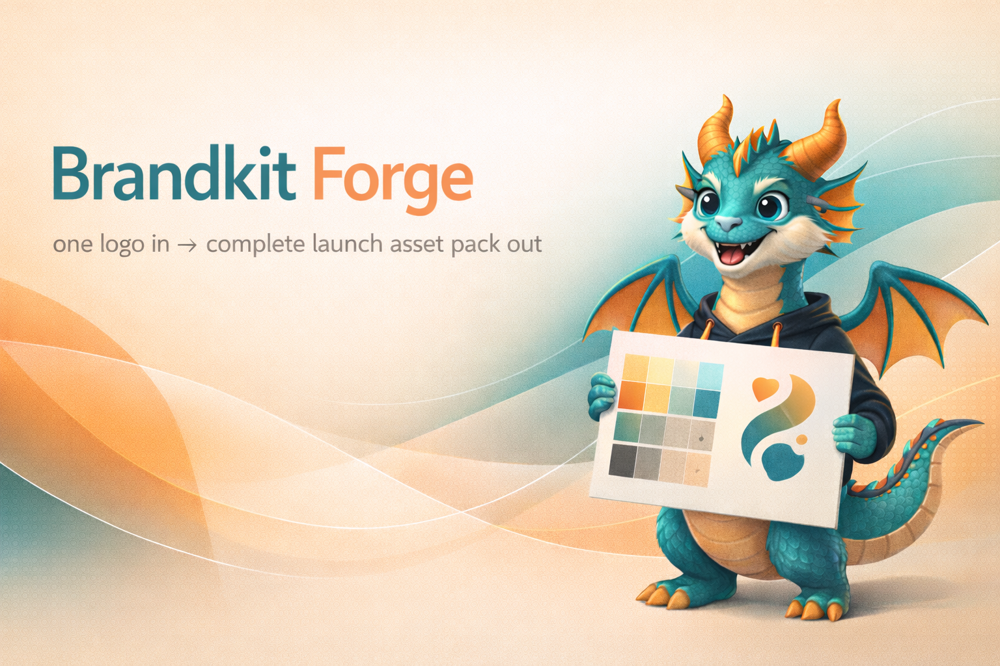
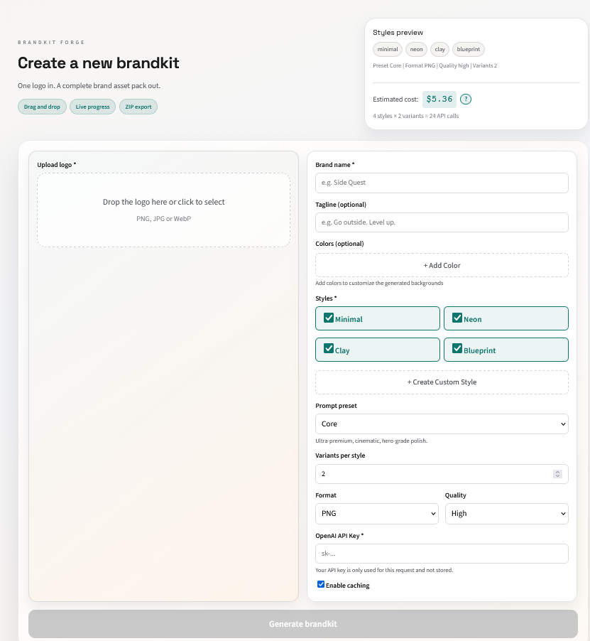

<div align="center">



# Brandkit Forge

### Transform a single logo into a complete brand asset pack with AI

[](https://github.com/Cosmic-Game-studios/Brandkit-Forge/actions)
[](https://www.npmjs.com/package/brandkit-forge)
[](https://opensource.org/licenses/MIT)
[](https://www.typescriptlang.org/)
[](https://openai.com)

<br />

[**Getting Started**](#-quick-start) · [**Documentation**](#-documentation) · [**API Reference**](#-api-reference) · [**Contributing**](#-contributing) · [**Roadmap**](#-roadmap)

<br />



---

**One logo in. A complete brand asset pack out.**

Brandkit Forge uses OpenAI's `gpt-image-1.5` to generate stunning backgrounds, hero compositions, icons, and social media assets—all from a single logo upload.

<br />

[](https://github.com/Cosmic-Game-studios/Brandkit-Forge)

</div>

---

## 💡 Why Brandkit Forge?

> **⚠️ Early Development Stage** — This project is in active early development. Features may change, and some functionality is still being refined. We welcome feedback and contributions!

**Built for the OpenAI Dev Challenge 2025**

This project was created as our submission for the [OpenAI Developer Challenge](https://openai.com). We wanted to showcase the powerful capabilities of OpenAI's new `gpt-image-1.5` API by solving a real problem that designers and developers face daily.

### The Problem

Creating a complete brand asset pack is tedious and time-consuming:
- Designers manually create dozens of variations for different use cases
- Developers need icons in 6+ sizes, social images in multiple formats
- Every rebrand means hours of repetitive export work
- Small teams and indie devs often skip professional branding due to cost

### Our Solution

**One logo upload → Complete brand kit in minutes.**

Brandkit Forge leverages both the **Generate** and **Edit** endpoints of `gpt-image-1.5`:
- **Generate API**: Creates unique, style-matched backgrounds
- **Edit API**: Intelligently composites the logo onto backgrounds with perfect placement

The result? Professional-quality brand assets that would normally take a designer hours, generated in minutes with full cost transparency.

---

## ✨ Features

<table>
<tr>
<td width="50%" valign="top">

### 🎨 AI-Powered Generation

- **Smart Backgrounds** — Context-aware backgrounds that complement your brand identity
- **Hero Compositions** — Professional logo placement with optional tagline
- **Multiple Styles** — Minimal, Neon, Clay, Blueprint + unlimited custom styles
- **Quality Presets** — Core, Soft, Bold, Noir aesthetic directions
- **Color Intelligence** — Automatic color palette detection and integration

</td>
<td width="50%" valign="top">

### 📦 Production Ready Assets

- **Complete Icon Pack** — 16px → 1024px, favicons included
- **Social Media Kit** — OG images, Twitter/X cards, LinkedIn banners
- **Multiple Formats** — PNG, WebP, JPEG with quality control
- **ZIP Export** — One-click download of all generated assets
- **JSON Manifest** — Full audit trail with prompts and parameters

</td>
</tr>
<tr>
<td width="50%" valign="top">

### 🛠 Developer Experience

- **CLI + Web UI** — Choose your preferred workflow
- **REST API** — Full programmatic access for automation
- **Real-time Updates** — Server-Sent Events for live progress
- **Live Cost Tracking** — Know your API costs before and during generation
- **TypeScript** — Fully typed codebase with excellent IDE support

</td>
<td width="50%" valign="top">

### 🏢 Enterprise Ready

- **Smart Caching** — Skip regeneration of identical requests
- **Dry Run Mode** — Preview all prompts without API calls
- **Parallel Processing** — Concurrent generation for speed
- **Error Recovery** — Graceful handling with detailed logs
- **Extensible** — Custom styles, presets, and pipelines

</td>
</tr>
</table>

---

## 🚀 Quick Start

### Prerequisites

| Requirement | Version |
|-------------|---------|
| Node.js | ≥ 18.0 |
| npm / yarn / pnpm | Latest |
| OpenAI API Key | With image access |

### Installation

```bash
# Clone the repository
git clone https://github.com/Cosmic-Game-studios/Brandkit-Forge.git

# Navigate to directory
cd Brandkit-Forge

# Install dependencies
npm install

# Build the project
npm run build

# Set up environment
echo "OPENAI_API_KEY=sk-your-key-here" > .env
```

### Generate Your First Brand Kit

```bash
# Using CLI
npm run forge -- \
  --logo ./your-logo.png \
  --name "Your Brand" \
  --styles "minimal,neon,blueprint"

# Or start the Web UI
npm run dev:web
# Then open http://localhost:3000
```

<details>
<summary>📸 <strong>See example output</strong></summary>

```
out/
└── 2025-01-15T10-30-00/
    ├── brandkit.json           # Complete manifest
    ├── gallery/
    │   └── index.html          # Visual gallery
    ├── icons/
    │   ├── favicon-16.png
    │   ├── favicon-32.png
    │   ├── app-icon-180.png
    │   ├── app-icon-192.png
    │   ├── app-icon-512.png
    │   └── app-icon-1024.png
    ├── social/
    │   ├── og-1200x630.png
    │   └── x-1600x900.png
    └── variants/
        ├── minimal/
        │   ├── 0/
        │   │   ├── background.png
        │   │   ├── hero-landscape.png
        │   │   └── hero-square.png
        │   └── 1/
        │       └── ...
        ├── neon/
        │   └── ...
        └── blueprint/
            └── ...
```

</details>

---

## 📖 Documentation

<details open>
<summary><h3>📟 CLI Reference</h3></summary>

```bash
brandkit-forge [options]
```

#### Required

| Flag | Description |
|------|-------------|
| `--logo <path>` | Path to logo file (PNG, WebP, JPEG) |
| `--name <name>` | Brand name for prompts |

#### Options

| Flag | Description | Default |
|------|-------------|---------|
| `--tagline <text>` | Brand tagline | — |
| `--colors <hex,hex>` | Brand colors (comma-separated) | Auto-detect |
| `--styles <list>` | Style names (comma-separated) | `minimal,neon,clay,blueprint` |
| `--preset <name>` | Visual preset | `core` |
| `-n <number>` | Variants per style | `2` |
| `--out <dir>` | Output directory | `./out` |
| `--format <fmt>` | Image format | `png` |
| `--quality <level>` | Generation quality | `high` |
| `--dry-run` | Preview prompts only | `false` |
| `--no-cache` | Disable caching | `false` |

#### Examples

```bash
# Minimal
brandkit-forge --logo logo.png --name "Acme"

# Full options
brandkit-forge \
  --logo ./assets/logo.png \
  --name "Side Quest" \
  --tagline "Go outside. Level up." \
  --colors "#6D28D9,#06B6D4" \
  --styles "minimal,neon,blueprint,clay" \
  --preset bold \
  -n 3 \
  --out ./brand-assets \
  --format webp \
  --quality high

# Preview without API calls
brandkit-forge --logo logo.png --name "Test" --dry-run
```

</details>

<details>
<summary><h3>🌐 Web UI</h3></summary>

The web interface provides a visual, drag-and-drop experience.

#### Start Server

```bash
# Development (hot reload)
npm run dev:web

# Production
npm run build:web && npm run start:web
```

#### URLs

| Service | URL |
|---------|-----|
| Frontend | http://localhost:3000 |
| Backend API | http://localhost:3001 |

#### Features

| Feature | Description |
|---------|-------------|
| 🖱️ Drag & Drop | Upload logo with drag and drop |
| 👁️ Live Preview | Real-time style and setting preview |
| 💰 Cost Estimation | See estimated costs before generating |
| 📊 Progress Tracking | SSE-powered real-time updates |
| 🖼️ Gallery View | Browse and download generated assets |
| 📥 ZIP Export | Download everything in one click |

</details>

<details>
<summary><h3>🎨 Presets & Styles</h3></summary>

#### Visual Presets

| Preset | Description | Use Case |
|--------|-------------|----------|
| `core` | Ultra-premium, cinematic, hero-grade | Product launches, premium brands |
| `soft` | Luminous luxury, dreamy softness | Lifestyle, wellness, creative |
| `bold` | Maximum contrast, bold energy | Gaming, tech startups, sports |
| `noir` | Dark, sleek, cinematic intensity | Luxury, finance, entertainment |

#### Built-in Styles

| Style | Description |
|-------|-------------|
| `minimal` | Clean lines, negative space, modern simplicity |
| `neon` | Vibrant glow, cyberpunk aesthetics, electric colors |
| `clay` | Soft 3D, tactile textures, playful depth |
| `blueprint` | Technical precision, schematic aesthetics |

#### Custom Styles

Create unlimited custom styles via Web UI or API:

```json
{
  "customStyles": {
    "retro-wave": "synthwave, neon grid, 80s retro futurism, purple cyan glow",
    "organic": "natural textures, earthy tones, botanical elements"
  }
}
```

</details>

<details>
<summary><h3>💰 Cost Estimation</h3></summary>

Real-time cost tracking based on OpenAI `gpt-image-1.5` pricing.

#### Pricing Table (December 2025)

| Quality | 1024×1024 | 1536×1024 | 1024×1536 |
|---------|-----------|-----------|-----------|
| **Low** | $0.01 | $0.015 | $0.015 |
| **Medium** | $0.04 | $0.06 | $0.06 |
| **High** | $0.17 | $0.25 | $0.25 |

#### Cost Formula

```
Total = Styles × Variants × 3 images × Price per image
```

#### Example Calculation

| Configuration | Calculation | Total |
|---------------|-------------|-------|
| 4 styles, 2 variants, high quality | 4 × 2 × 3 × ~$0.22 | **~$5.28** |
| 2 styles, 1 variant, low quality | 2 × 1 × 3 × ~$0.013 | **~$0.08** |

> ⚠️ **Note:** Actual costs may vary slightly based on OpenAI's token-based pricing for prompts.

</details>

---

## 🔌 API Reference

<details open>
<summary><h3>Endpoints</h3></summary>

#### Base URL
```
http://localhost:3001/api
```

---

#### `POST /api/jobs` — Create Job

Create a new brand kit generation job.

**Request:**
```http
POST /api/jobs
Content-Type: multipart/form-data
```

| Field | Type | Required | Description |
|-------|------|----------|-------------|
| `file` | File | ✅ | Logo image |
| `config` | JSON | ✅ | Configuration |

**Config Schema:**
```typescript
interface Config {
  name: string;           // Brand name (required)
  tagline?: string;       // Optional tagline
  colors?: string;        // Comma-separated hex colors
  styles?: string;        // Comma-separated style names
  preset?: string;        // core | soft | bold | noir
  n?: string;             // Variants per style
  format?: string;        // png | webp | jpeg
  quality?: string;       // low | medium | high | auto
  apiKey?: string;        // OpenAI API key
  customStyles?: object;  // Custom style definitions
}
```

**Response:**
```json
{
  "jobId": "550e8400-e29b-41d4-a716-446655440000"
}
```

---

#### `GET /api/jobs/:id/events` — Progress Stream

Subscribe to real-time job progress via Server-Sent Events.

**Request:**
```http
GET /api/jobs/:id/events
Accept: text/event-stream
```

**Events:**
```javascript
// Progress update
data: {"message": "Generating background for minimal style..."}

// Cost update
data: {"cost": {"totalCost": 0.25, "apiCalls": 1, "breakdown": {...}}}

// Completion
data: {"status": "completed"}

// Error
data: {"status": "error"}
```

---

#### `GET /api/jobs/:id/result` — Get Result

Retrieve completed job results.

**Response:**
```json
{
  "manifest": {
    "timestamp": "2025-01-15T10:30:00.000Z",
    "input": {...},
    "config": {...},
    "prompts": {...},
    "generated": {...}
  },
  "files": [
    {
      "path": "variants/minimal/0/hero-landscape.png",
      "url": "http://localhost:3001/api/jobs/:id/files/variants/minimal/0/hero-landscape.png"
    }
  ],
  "outputDir": "/path/to/output"
}
```

---

#### `GET /api/jobs/:id/files/*` — Get File

Download individual generated files.

---

#### `GET /api/jobs/:id/download` — Download ZIP

Download all generated assets as a ZIP archive.

**Response:**
```http
Content-Type: application/zip
Content-Disposition: attachment; filename="brandkit-{id}.zip"
```

</details>

---

## 🏗️ Architecture

```
┌────────────────────────────────────────────────────────────────────────┐
│                              FRONTEND                                   │
│                        React + Vite + TypeScript                        │
│  ┌──────────────┐  ┌──────────────┐  ┌──────────────┐  ┌────────────┐  │
│  │    Create    │  │   Results    │  │    Gallery   │  │  Settings  │  │
│  │     Page     │  │     Page     │  │     View     │  │            │  │
│  └──────────────┘  └──────────────┘  └──────────────┘  └────────────┘  │
└────────────────────────────────────────────────────────────────────────┘
                                    │
                          HTTP / Server-Sent Events
                                    │
                                    ▼
┌────────────────────────────────────────────────────────────────────────┐
│                            API SERVER                                   │
│                      Fastify + TypeScript                               │
│  ┌──────────────┐  ┌──────────────┐  ┌──────────────┐  ┌────────────┐  │
│  │    Routes    │  │     Jobs     │  │  SSE Events  │  │    Auth    │  │
│  │   Handler    │  │   Manager    │  │   Streamer   │  │  (API Key) │  │
│  └──────────────┘  └──────────────┘  └──────────────┘  └────────────┘  │
└────────────────────────────────────────────────────────────────────────┘
                                    │
                                    ▼
┌────────────────────────────────────────────────────────────────────────┐
│                           CORE ENGINE                                   │
│  ┌──────────────┐  ┌──────────────┐  ┌──────────────┐  ┌────────────┐  │
│  │    Forge     │  │   Prompts    │  │    Cache     │  │    Cost    │  │
│  │ Orchestrator │  │   Builder    │  │   Manager    │  │  Tracker   │  │
│  └──────────────┘  └──────────────┘  └──────────────┘  └────────────┘  │
└────────────────────────────────────────────────────────────────────────┘
                                    │
                                    ▼
┌────────────────────────────────────────────────────────────────────────┐
│                            PIPELINE                                     │
│  ┌────────────────┐  ┌────────────────┐  ┌────────────────────────┐    │
│  │   Background   │  │      Hero      │  │    Export & Resize     │    │
│  │   Generator    │  │    Composer    │  │   (Icons, Social, ZIP) │    │
│  │  (Generate API)│  │   (Edit API)   │  │       (Sharp)          │    │
│  └────────────────┘  └────────────────┘  └────────────────────────┘    │
└────────────────────────────────────────────────────────────────────────┘
                                    │
                                    ▼
┌────────────────────────────────────────────────────────────────────────┐
│                        EXTERNAL SERVICES                                │
│  ┌────────────────────────────────────────────────────────────────┐    │
│  │                    OpenAI Images API                            │    │
│  │                      gpt-image-1.5                              │    │
│  │              Generate API  •  Edit API                          │    │
│  └────────────────────────────────────────────────────────────────┘    │
└────────────────────────────────────────────────────────────────────────┘
```

#### Key Files

| Path | Description |
|------|-------------|
| `src/core/forge.ts` | Main orchestration engine |
| `src/lib/openai.ts` | OpenAI client + cost calculation |
| `src/lib/prompts.ts` | Prompt templates and builders |
| `src/pipeline/` | Generation pipelines |
| `src/server/` | Fastify API server |
| `web/src/` | React frontend |

---

## 🤝 Contributing

We welcome contributions of all kinds!

### Development Setup

```bash
# Fork and clone
git clone https://github.com/YOUR_USERNAME/Brandkit-Forge.git
cd Brandkit-Forge

# Install dependencies
npm install

# Start development
npm run dev:web

# Run checks
npm run typecheck
npm run lint
```

### Contribution Process

1. **Fork** the repository
2. **Create** a feature branch: `git checkout -b feature/amazing-feature`
3. **Commit** changes: `git commit -m 'Add amazing feature'`
4. **Push** to branch: `git push origin feature/amazing-feature`
5. **Open** a Pull Request

### PR Checklist

- [ ] TypeScript types are properly defined
- [ ] No linting errors
- [ ] Tested locally
- [ ] Documentation updated (if needed)
- [ ] Screenshots included (for UI changes)

---

## 🗺️ Roadmap

| Version | Feature | Status |
|---------|---------|--------|
| **v1.0** | Core CLI + Web UI | ✅ Released |
| **v1.1** | Live cost tracking | ✅ Released |
| **v1.2** | Custom styles | ✅ Released |
| **v1.3** | Figma plugin export | 🔄 In Progress |
| **v1.4** | Batch processing | 📋 Planned |
| **v2.0** | Team workspaces | 📋 Planned |
| **v2.1** | Community presets | 📋 Planned |
| **v2.2** | Design system export | 📋 Planned |

[View all planned features →](https://github.com/Cosmic-Game-studios/Brandkit-Forge/issues)

---

## ❓ FAQ

<details>
<summary><strong>What image formats are supported for logos?</strong></summary>

PNG, WebP, and JPEG. We recommend PNG with transparency for best results.
</details>

<details>
<summary><strong>How much does it cost to generate a brand kit?</strong></summary>

Costs depend on quality and quantity. A typical kit (4 styles, 2 variants, high quality) costs ~$5-6. Use `--quality low` for drafts (~$0.50).
</details>

<details>
<summary><strong>Can I use my own OpenAI API key?</strong></summary>

Yes! Enter it in the Web UI or set `OPENAI_API_KEY` in your `.env` file.
</details>

<details>
<summary><strong>Is there rate limiting?</strong></summary>

We respect OpenAI's rate limits. Reduce variants or styles if you hit limits.
</details>

<details>
<summary><strong>Can I create custom styles?</strong></summary>

Yes! Use the "Add custom style" button in the Web UI or pass `customStyles` via API.
</details>

<details>
<summary><strong>How do I clear the cache?</strong></summary>

```bash
rm -rf .cache/
# Or use --no-cache flag for a single run
```
</details>

---

## 🔒 Security

| Aspect | Implementation |
|--------|----------------|
| **API Keys** | Never committed, stored in env only |
| **File Validation** | Only image files accepted |
| **Job Isolation** | Each job runs in isolated temp directory |
| **No Retention** | Generated files not stored permanently |
| **HTTPS Ready** | Production deployment supports SSL |

Report vulnerabilities to **security@cosmic-game-studios.com**

---

## 📄 License

```
MIT License

Copyright (c) 2025 Cosmic Game Studios

Permission is hereby granted, free of charge, to any person obtaining a copy
of this software and associated documentation files (the "Software"), to deal
in the Software without restriction, including without limitation the rights
to use, copy, modify, merge, publish, distribute, sublicense, and/or sell
copies of the Software, and to permit persons to whom the Software is
furnished to do so, subject to the following conditions:

The above copyright notice and this permission notice shall be included in all
copies or substantial portions of the Software.

THE SOFTWARE IS PROVIDED "AS IS", WITHOUT WARRANTY OF ANY KIND, EXPRESS OR
IMPLIED, INCLUDING BUT NOT LIMITED TO THE WARRANTIES OF MERCHANTABILITY,
FITNESS FOR A PARTICULAR PURPOSE AND NONINFRINGEMENT. IN NO EVENT SHALL THE
AUTHORS OR COPYRIGHT HOLDERS BE LIABLE FOR ANY CLAIM, DAMAGES OR OTHER
LIABILITY, WHETHER IN AN ACTION OF CONTRACT, TORT OR OTHERWISE, ARISING FROM,
OUT OF OR IN CONNECTION WITH THE SOFTWARE OR THE USE OR OTHER DEALINGS IN THE
SOFTWARE.
```

---

## 🙏 Acknowledgements

<table>
<tr>
<td align="center"><a href="https://openai.com"></a><br />Images API</td>
<td align="center"><a href="https://sharp.pixelplumbing.com/"></a><br />Image Processing</td>
<td align="center"><a href="https://www.fastify.io/"></a><br />Web Framework</td>
<td align="center"><a href="https://react.dev/"></a><br />UI Library</td>
<td align="center"><a href="https://vitejs.dev/"></a><br />Build Tool</td>
</tr>
</table>

---

<div align="center">

### Built with ❤️ by [Cosmic Game Studios](https://github.com/Cosmic-Game-studios)

<br />

[](https://github.com/Cosmic-Game-studios/Brandkit-Forge/stargazers)
[](https://github.com/Cosmic-Game-studios/Brandkit-Forge/network/members)
[](https://twitter.com/cosmicgamestudios)

<br />

[⬆ Back to Top](#brandkit-forge)

</div>
