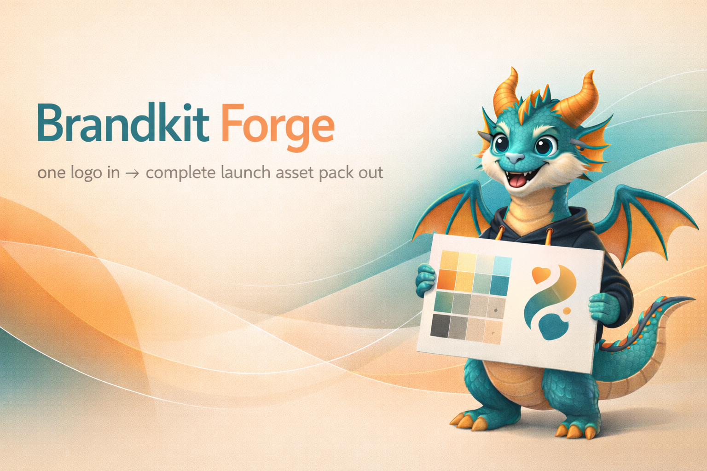
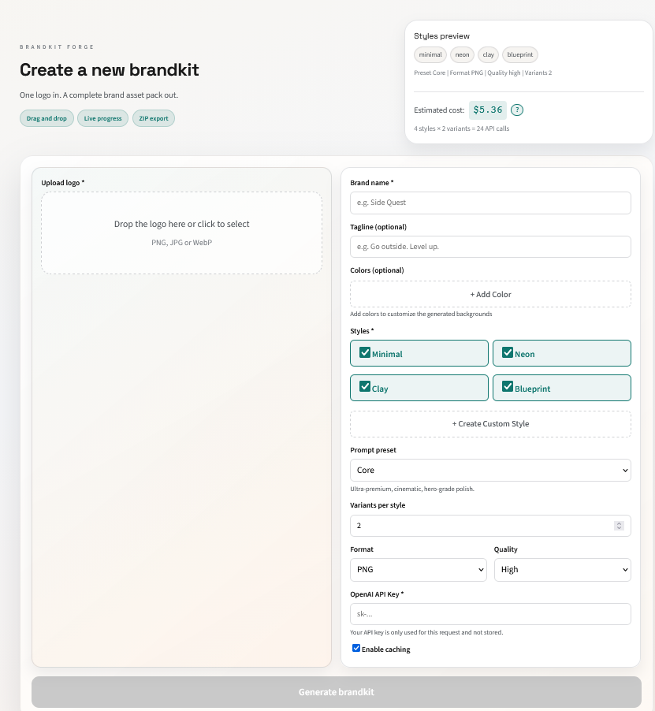
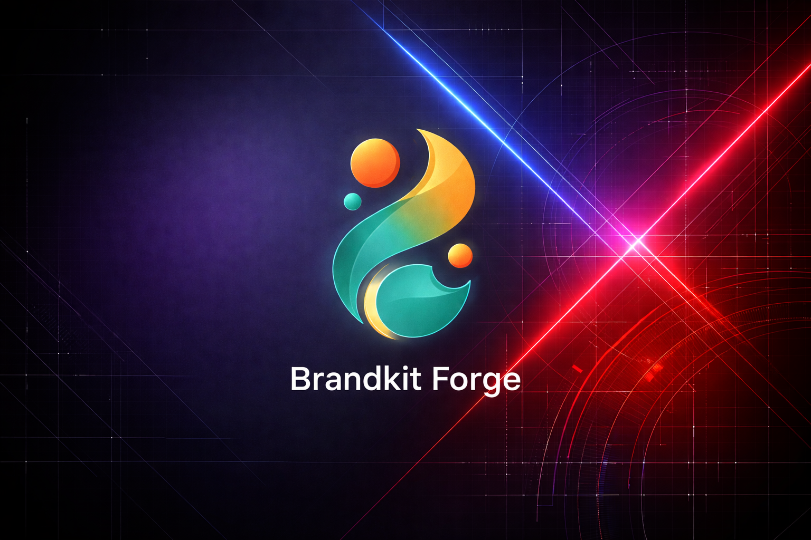
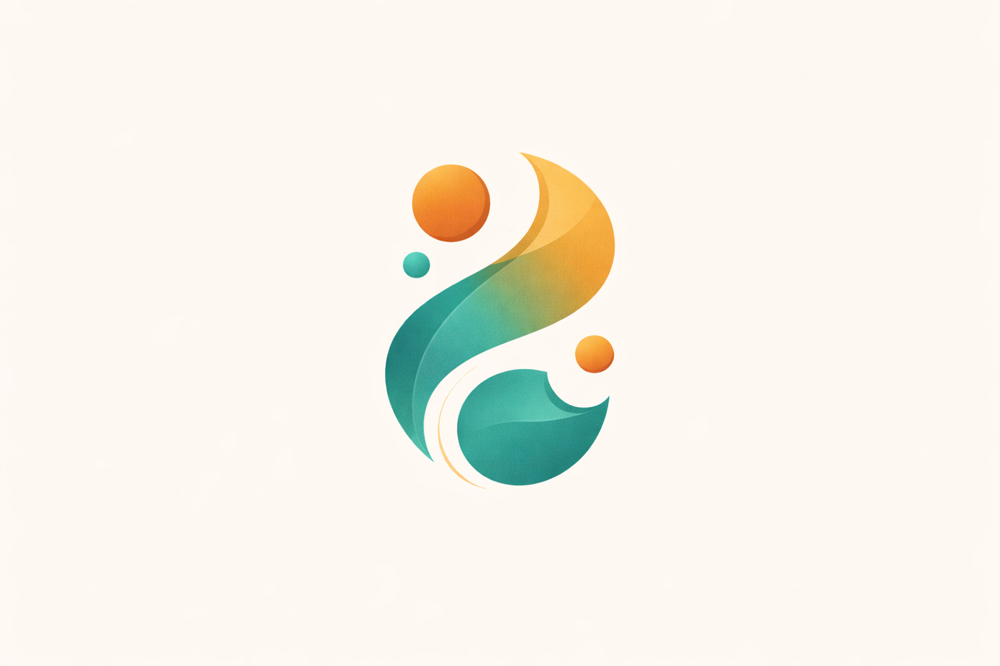
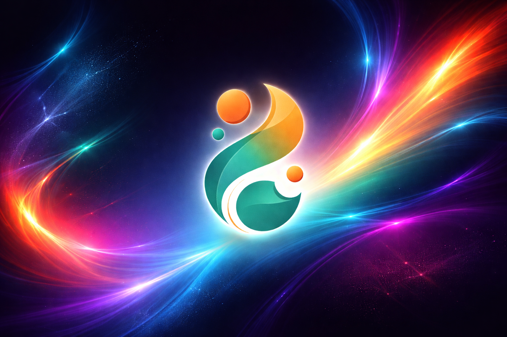

<div align="center">



# Brandkit Forge

### Transform a single logo into a complete brand asset pack with AI

[](https://github.com/Cosmic-Game-studios/Brandkit-Forge/actions)
[](https://www.npmjs.com/package/brandkit-forge)
[](https://opensource.org/licenses/MIT)
[](https://www.typescriptlang.org/)
[](https://openai.com)

<br />

[**Getting Started**](#-quick-start) · [**Documentation**](#-documentation) · [**API Reference**](#-api-reference) · [**Contributing**](#-contributing) · [**Roadmap**](#-roadmap)

<br />



> **🚀 v2.0 Risen Major Update:** 8 visual styles, 8 presets, 12 industry templates, AI color extraction, dark mode, modernized gallery, performance tracking, and enhanced CLI.

<br />

> **🏆 1st Place — Community Dev Challenge (Image Gen API):** Recognized for clean execution and the strongest overall use of the Image API.

<br />

### Example Output



*Hero image generated by Brandkit Forge — neon style*

---

**One logo in. A complete brand asset pack out.**

Brandkit Forge uses OpenAI's `gpt-image-1.5` to generate stunning backgrounds, hero compositions, icons, and social media assets—all from a single logo upload.

<br />

[](https://github.com/Cosmic-Game-studios/Brandkit-Forge)

</div>

---

## 💡 Why Brandkit Forge?

> **⚠️ Early Development Stage** — This project is in active early development. Features may change, and some functionality is still being refined. We welcome feedback and contributions!

**Built for the OpenAI Dev Challenge 2025**

This project was created as our submission for the [OpenAI Developer Challenge](https://openai.com). We wanted to showcase the powerful capabilities of OpenAI's new `gpt-image-1.5` API by solving a real problem that designers and developers face daily.

### The Problem

Creating a complete brand asset pack is tedious and time-consuming:
- Designers manually create dozens of variations for different use cases
- Developers need icons in 6+ sizes, social images in multiple formats
- Every rebrand means hours of repetitive export work
- Small teams and indie devs often skip professional branding due to cost

### Our Solution

**One logo upload → Complete brand kit in minutes.**

Brandkit Forge leverages both the **Generate** and **Edit** endpoints of `gpt-image-1.5`:
- **Generate API**: Creates unique, style-matched backgrounds
- **Edit API**: Intelligently composites the logo onto backgrounds with perfect placement

The result? Professional-quality brand assets that would normally take a designer hours, generated in minutes with full cost transparency.

---

## ✨ Features

<table>
<tr>
<td width="50%" valign="top">

### 🎨 AI-Powered Generation

- **Smart Backgrounds** — Context-aware backgrounds that complement your brand identity
- **Hero Compositions** — Professional logo placement with optional tagline
- **8 Visual Styles** — Minimal, Neon, Clay, Blueprint, Gradient, Retro, Glassmorphism, Watercolor
- **8 Quality Presets** — Core, Soft, Bold, Noir, Zen, Electric, Vintage, Fresh
- **12 Industry Templates** — Tech, Creative, Finance, Food, Fashion, Health, Gaming, Education, Music, Eco, Vintage, Minimal
- **AI Color Extractor** — Auto-detect dominant colors from logo with smart style/preset suggestions
- **Image Size Options** — Landscape (1536×1024), Square (1024×1024), Portrait (1024×1536)

</td>
<td width="50%" valign="top">

### 📦 Production Ready Assets

- **Complete Icon Pack** — 16px → 1024px, favicons included
- **Social Media Kit** — OG images, Twitter/X cards, LinkedIn banners
- **Multiple Formats** — PNG, WebP, JPEG with compression control
- **Transparency Support** — PNG alpha channel for transparent backgrounds
- **ZIP Export** — One-click download of all generated assets
- **JSON Manifest** — Full audit trail with prompts and parameters

</td>
</tr>
<tr>
<td width="50%" valign="top">

### 🛠 Developer Experience

- **CLI + Modern Web UI** — Choose your preferred workflow
- **Wizard-Based Interface** — Intuitive 3-step guided process
- **Quick Start Templates** — One-click industry templates for instant configuration
- **Dark Mode** — Full dark/light theme with system preference detection
- **Advanced Settings Panel** — Fine-tune image size, format, and compression
- **REST API** — Full programmatic access with new endpoints for templates, presets, and color analysis
- **Real-time Updates** — Server-Sent Events for live progress
- **Live Cost Tracking** — Dynamic cost estimation based on settings
- **Performance Stats** — Per-step timing breakdown with visual charts
- **TypeScript** — Fully typed codebase with excellent IDE support

</td>
<td width="50%" valign="top">

### 🏢 Enterprise Ready

- **Smart Caching** — Skip regeneration of identical requests
- **Dry Run Mode** — Preview all prompts without API calls
- **Parallel Processing** — Concurrent generation for speed
- **Error Recovery** — Graceful handling with detailed logs
- **Extensible** — Custom styles, presets, and pipelines
- **Performance Tracking** — Per-step duration metrics in forge engine

</td>
</tr>
</table>

---

## 🎨 Modern Web Interface

**Experience a polished, professional UI** built with Tailwind CSS and modern design principles.

### Key UI Features

- **🧙‍♂️ Wizard Flow** — Guided 3-step process (Identity → Aesthetics → Configuration) makes brandkit creation intuitive
- **🚀 Quick Start Templates** — One-click industry templates pre-configure styles, presets, colors, and settings
- **🌙 Dark Mode** — Full dark/light theme toggle with system preference detection and localStorage persistence
- **👁️ Live Preview** — Real-time preview card in the sidebar shows your selections as you configure
- **⚙️ Advanced Settings** — Expandable panel for image size, format, compression, and transparency options
- **💰 Dynamic Cost Display** — Cost estimation updates in real-time based on selected settings
- **✨ Smooth Animations** — Fluid transitions and micro-interactions throughout the interface
- **📱 Responsive Design** — Works beautifully on desktop, tablet, and mobile devices
- **🎯 Clear Navigation** — Step-by-step progress indicator keeps you oriented
- **🖼️ Lightbox Preview** — Click any image to view full-size with zoom overlay
- **📂 Category Tabs** — Filter results by All, Backgrounds, Heroes, Icons, or Social
- **📋 Collapsible Manifest** — View generation details without cluttering the gallery

---

## 🎮 Demo Mode

**Try Brandkit Forge without an API key!** Demo Mode generates prompts you can use to create your brand assets manually.

<table>
<tr>
<td width="33%" align="center">
<strong>1. Configure in Demo Mode</strong><br />
<br />
<em>Wizard flow: Identity → Aesthetics → Configuration</em>
</td>
<td width="33%" align="center">
<strong>2. Copy Generated Prompts</strong><br />
<br />
<em>Use the prompts with any AI image generator</em>
</td>
<td width="33%" align="center">
<strong>3. Get Your Hero Image</strong><br />
<br />
<em>Professional brand asset ready to use</em>
</td>
</tr>
</table>

> **Note:** Screenshots are being updated to reflect the v2.0 redesign with dark mode, industry templates, and expanded styles.

```bash
# Start the Web UI
npm run dev:web

# Enable "Demo Mode" checkbox → No API key needed!
```

---

## 🚀 Quick Start

### Prerequisites

| Requirement | Version |
|-------------|---------|
| Node.js | ≥ 18.0 |
| npm / yarn / pnpm | Latest |
| OpenAI API Key | With image access |

### Installation

```bash
# Clone the repository
git clone https://github.com/Cosmic-Game-studios/Brandkit-Forge.git

# Navigate to directory
cd Brandkit-Forge

# Install dependencies
npm install

# Build the project
npm run build

# Set up environment
echo "OPENAI_API_KEY=sk-your-key-here" > .env
```

### Generate Your First Brand Kit

```bash
# Using CLI
npm run forge -- \
  --logo ./your-logo.png \
  --name "Your Brand" \
  --styles "minimal,neon,blueprint"

# Or start the Web UI
npm run dev:web
# Then open http://localhost:3000
```

<details>
<summary>📸 <strong>See example output</strong></summary>

```
out/
└── 2025-01-15T10-30-00/
    ├── brandkit.json           # Complete manifest
    ├── gallery/
    │   └── index.html          # Visual gallery
    ├── icons/
    │   ├── favicon-16.png
    │   ├── favicon-32.png
    │   ├── app-icon-180.png
    │   ├── app-icon-192.png
    │   ├── app-icon-512.png
    │   └── app-icon-1024.png
    ├── social/
    │   ├── og-1200x630.png
    │   └── x-1600x900.png
    └── variants/
        ├── minimal/
        │   ├── 0/
        │   │   ├── background.png
        │   │   ├── hero-landscape.png
        │   │   └── hero-square.png
        │   └── 1/
        │       └── ...
        ├── neon/
        │   └── ...
        └── blueprint/
            └── ...
```

</details>

---

## 📖 Documentation

<details open>
<summary><h3>📟 CLI Reference</h3></summary>

```bash
brandkit-forge [options]
```

#### Required

| Flag | Description |
|------|-------------|
| `--logo <path>` | Path to logo file (PNG, WebP, JPEG) |
| `--name <name>` | Brand name for prompts |

#### Options

| Flag | Description | Default |
|------|-------------|---------|
| `--tagline <text>` | Brand tagline | — |
| `--colors <hex,hex>` | Brand colors (comma-separated) | Auto-detect |
| `--styles <list>` | Style names (comma-separated) | `minimal,neon,clay,blueprint` |
| `--preset <name>` | Visual preset | `core` |
| `--template <id>` | Use an industry template | — |
| `--list-templates` | List available industry templates | — |
| `--analyze-colors` | Auto-extract dominant colors from logo | `false` |
| `-n <number>` | Variants per style | `2` |
| `--out <dir>` | Output directory | `./out` |
| `--format <fmt>` | Image format (png, webp, jpeg) | `png` |
| `--quality <level>` | Generation quality | `high` |
| `--size <size>` | Image size (landscape, square, portrait) | `landscape` |
| `--compression <num>` | JPEG compression (50-100) | `85` |
| `--transparent` | Enable PNG transparency | `false` |
| `--dry-run` | Preview prompts only | `false` |
| `--no-cache` | Disable caching | `false` |

#### Available Styles

`minimal`, `neon`, `clay`, `blueprint`, `gradient`, `retro`, `glassmorphism`, `watercolor`

#### Available Presets

`core`, `soft`, `bold`, `noir`, `zen`, `electric`, `vintage`, `fresh`

#### Examples

```bash
# Minimal
brandkit-forge --logo logo.png --name "Acme"

# Use an industry template
brandkit-forge --logo logo.png --name "Acme" --template tech-startup

# Auto-detect colors from logo
brandkit-forge --logo logo.png --name "Acme" --analyze-colors

# List all templates
brandkit-forge --logo logo.png --name "x" --list-templates

# New styles: watercolor + glassmorphism with zen preset
brandkit-forge \
  --logo ./assets/logo.png \
  --name "Harmony" \
  --styles "watercolor,glassmorphism,gradient" \
  --preset zen \
  -n 2

# Full options
brandkit-forge \
  --logo ./assets/logo.png \
  --name "Side Quest" \
  --tagline "Go outside. Level up." \
  --colors "#6D28D9,#06B6D4" \
  --styles "minimal,neon,retro,gradient" \
  --preset electric \
  -n 3 \
  --out ./brand-assets \
  --format webp \
  --quality high

# Preview without API calls
brandkit-forge --logo logo.png --name "Test" --dry-run
```

</details>

<details>
<summary><h3>🌐 Web UI</h3></summary>

The web interface provides a modern, intuitive experience with a guided wizard flow. Built with **Tailwind CSS** and **Lucide Icons** for a polished, professional design.

#### Start Server

```bash
# Development (hot reload)
npm run dev:web

# Production
npm run build:web && npm run start:web
```

#### URLs

| Service | URL |
|---------|-----|
| Frontend | http://localhost:3000 |
| Backend API | http://localhost:3001 |

#### Features

| Feature | Description |
|---------|-------------|
| 🧙‍♂️ **Wizard Flow** | Guided 3-step process (Identity → Aesthetics → Configuration) |
| 🚀 **Template Picker** | Quick start with 12 industry templates — one click to configure everything |
| 🌙 **Dark Mode** | Full dark/light toggle with system preference and localStorage persistence |
| 🖱️ **Drag & Drop** | Upload logo with drag and drop |
| 👁️ **Live Preview** | Real-time style and setting preview in sidebar |
| ⚙️ **Advanced Settings** | Image size, format (PNG/WebP/JPEG), compression, transparency |
| 💰 **Dynamic Cost** | Cost estimation updates based on size and quality settings |
| 📊 **Progress Tracking** | SSE-powered real-time updates with beautiful UI |
| 🖼️ **Lightbox Gallery** | Click-to-zoom image preview with ESC to close |
| 📂 **Category Tabs** | Filter by All, Backgrounds, Heroes, Icons, Social |
| 📥 **ZIP Export** | Download everything in one click |
| 🎨 **Modern Design** | Built with Tailwind CSS with CSS variable theming |
| ✨ **Smooth Animations** | Fluid transitions, fade-in, slide-up effects throughout |

</details>

<details>
<summary><h3>🎨 Presets & Styles</h3></summary>

#### Visual Presets (8)

| Preset | Description | Use Case |
|--------|-------------|----------|
| `core` | Ultra-premium, cinematic, hero-grade | Product launches, premium brands |
| `soft` | Luminous luxury, dreamy softness | Lifestyle, wellness, creative |
| `bold` | Maximum contrast, bold energy | Gaming, tech startups, sports |
| `noir` | Dark, sleek, cinematic intensity | Luxury, finance, entertainment |
| `zen` | Calm, balanced, meditative serenity | Health, wellness, mindfulness |
| `electric` | High-voltage energy, vivid spectrum bursts | Gaming, esports, music |
| `vintage` | Warm nostalgic tones, classic elegance | Heritage brands, artisan, craft |
| `fresh` | Vibrant, youthful, clean modern optimism | Education, food, startups |

#### Built-in Styles (8)

| Style | Description |
|-------|-------------|
| `minimal` | Clean lines, negative space, modern simplicity |
| `neon` | Vibrant glow, cyberpunk aesthetics, electric colors |
| `clay` | Soft 3D, tactile textures, playful depth |
| `blueprint` | Technical precision, schematic aesthetics |
| `gradient` | Rich multi-layered gradients, aurora color transitions |
| `retro` | Vintage halftone textures, warm analog tones, nostalgic pop art |
| `glassmorphism` | Frosted glass layers, translucent surfaces, modern UI aesthetic |
| `watercolor` | Soft watercolor washes, organic paint bleeds, fine art quality |

#### Industry Templates (12)

One-click templates that pre-configure styles, presets, colors, and settings:

| Template | Industry | Styles | Preset |
|----------|----------|--------|--------|
| Tech Startup | Technology | minimal, gradient, glassmorphism | core |
| Creative Agency | Creative | watercolor, gradient, clay | bold |
| Finance & Banking | Finance | minimal, blueprint, glassmorphism | noir |
| Food & Beverage | Food | watercolor, retro, clay | fresh |
| Fashion & Luxury | Fashion | minimal, glassmorphism, gradient | noir |
| Health & Wellness | Health | minimal, watercolor, gradient | zen |
| Gaming & Esports | Gaming | neon, gradient, glassmorphism | electric |
| Education | Education | clay, minimal, gradient | fresh |
| Music & Entertainment | Entertainment | retro, neon, gradient | electric |
| Eco & Sustainable | Environment | watercolor, minimal, clay | zen |
| Vintage & Craft | Craft | retro, watercolor, blueprint | vintage |
| Minimal Modern | General | minimal, glassmorphism | soft |

#### Custom Styles

Create unlimited custom styles via Web UI or API:

```json
{
  "customStyles": {
    "synthwave": "synthwave, neon grid, 80s retro futurism, purple cyan glow",
    "organic": "natural textures, earthy tones, botanical elements"
  }
}
```

</details>

<details>
<summary><h3>🧩 Chip-Based Prompt Builder</h3></summary>

Build custom styles and presets visually using the intuitive chip selector — no prompt engineering required!

#### How It Works

Instead of writing complex prompts manually, select properties from curated categories. The system automatically assembles them into optimized prompts.

#### Style Builder Categories

| Category | Available Chips |
|----------|-----------------|
| **Look** | minimal, neon, clay, blueprint, gradient, retro, glassmorphism, watercolor, futuristic, organic, brutalist |
| **Surface** | clean planes, smooth gradients, rough texture, glass, metallic, matte, holographic, iridescent, frosted, watercolor wash |
| **Lighting** | architectural, studio, dramatic, soft glow, rim light, ambient, spot light, diffused, golden hour, electric |
| **Mood** | museum-grade, premium, playful, corporate, artistic, tech, luxury, indie, zen, retro-futuristic |
| **Form** | abstract, geometric, fluid, angular, rounded, layered, flat, 3D depth, organic flow, paint bleeds |

#### Preset Builder Categories

| Category | Available Chips |
|----------|-----------------|
| **Lighting** | cinematic, soft, dramatic, natural, studio, neon, golden hour, moody |
| **Atmosphere** | premium, minimal, bold, calm, energetic, dreamy, intense, elegant |
| **Style** | modern, vintage, futuristic, organic, geometric, abstract, clean, textured |
| **Depth** | deep shadows, soft shadows, flat, layered, 3D, gradient, high contrast, low contrast |
| **Finish** | polished, matte, glossy, silky, refined, sharp, smooth, crisp |

#### Live Prompt Preview

As you select chips, see exactly how they'll be used in the actual AI prompt:

```
Create an abstract background for a premium brand hero.
Intended use: logo placement background for a launch asset.
Style: retro, holographic, dramatic, luxury, geometric.
Mood: cinematic, bold, modern, high contrast, polished.
Scene: background only, no objects.
...
```

#### Custom Presets via API

```json
{
  "customPresets": {
    "synthwave": {
      "description": "80s retro futurism with neon vibes",
      "background": "neon, bold, futuristic, high contrast, glossy",
      "edit": "cinematic, intense, modern, polished, sharp"
    }
  }
}
```

</details>

<details>
<summary><h3>💰 Cost Estimation</h3></summary>

Real-time cost tracking based on OpenAI `gpt-image-1.5` pricing.

#### Pricing Table (December 2025)

| Quality | 1024×1024 | 1536×1024 | 1024×1536 |
|---------|-----------|-----------|-----------|
| **Low** | $0.01 | $0.015 | $0.015 |
| **Medium** | $0.04 | $0.06 | $0.06 |
| **High** | $0.17 | $0.25 | $0.25 |

#### Cost Formula

```
Total = Styles × Variants × 3 images × Price per image (based on size)
```

#### Example Calculation

| Configuration | Size | Calculation | Total |
|---------------|------|-------------|-------|
| 4 styles, 2 variants, high quality | Landscape | 4 × 2 × 3 × $0.25 | **~$6.00** |
| 4 styles, 2 variants, high quality | Square | 4 × 2 × 3 × $0.17 | **~$4.08** |
| 2 styles, 1 variant, low quality | Square | 2 × 1 × 3 × $0.01 | **~$0.06** |

> ⚠️ **Note:** Actual costs may vary slightly based on OpenAI's token-based pricing for prompts.

</details>

---

## 🔌 API Reference

<details open>
<summary><h3>Endpoints</h3></summary>

#### Base URL
```
http://localhost:3001/api
```

---

#### `POST /api/jobs` — Create Job

Create a new brand kit generation job.

**Request:**
```http
POST /api/jobs
Content-Type: multipart/form-data
```

| Field | Type | Required | Description |
|-------|------|----------|-------------|
| `file` | File | ✅ | Logo image |
| `config` | JSON | ✅ | Configuration |

**Config Schema:**
```typescript
interface Config {
  name: string;           // Brand name (required)
  tagline?: string;       // Optional tagline
  colors?: string;        // Comma-separated hex colors
  styles?: string;        // Comma-separated style names
  preset?: string;        // core | soft | bold | noir | zen | electric | vintage | fresh
  n?: string;             // Variants per style
  format?: string;        // png | webp | jpeg
  quality?: string;       // low | medium | high | auto
  size?: string;          // landscape | square | portrait
  compression?: number;   // JPEG compression 50-100
  transparent?: boolean;  // PNG transparency
  apiKey?: string;        // OpenAI API key
  customStyles?: object;  // Custom style definitions
  customPresets?: object; // Custom preset definitions
}
```

**Response:**
```json
{
  "jobId": "550e8400-e29b-41d4-a716-446655440000"
}
```

---

#### `GET /api/jobs/:id/events` — Progress Stream

Subscribe to real-time job progress via Server-Sent Events.

**Request:**
```http
GET /api/jobs/:id/events
Accept: text/event-stream
```

**Events:**
```javascript
// Progress update
data: {"message": "Generating background for minimal style..."}

// Cost update
data: {"cost": {"totalCost": 0.25, "apiCalls": 1, "breakdown": {...}}}

// Completion
data: {"status": "completed"}

// Error
data: {"status": "error"}
```

---

#### `GET /api/jobs/:id/result` — Get Result

Retrieve completed job results.

**Response:**
```json
{
  "manifest": {
    "timestamp": "2025-01-15T10:30:00.000Z",
    "input": {...},
    "config": {...},
    "prompts": {...},
    "generated": {...}
  },
  "files": [
    {
      "path": "variants/minimal/0/hero-landscape.png",
      "url": "http://localhost:3001/api/jobs/:id/files/variants/minimal/0/hero-landscape.png"
    }
  ],
  "outputDir": "/path/to/output"
}
```

---

#### `GET /api/jobs/:id/files/*` — Get File

Download individual generated files.

---

#### `GET /api/jobs/:id/download` — Download ZIP

Download all generated assets as a ZIP archive.

**Response:**
```http
Content-Type: application/zip
Content-Disposition: attachment; filename="brandkit-{id}.zip"
```

---

#### `GET /api/templates` — List Templates *(v2.0)*

Returns all 12 industry templates with their configurations.

**Response:**
```json
[
  {
    "id": "tech-startup",
    "name": "Tech Startup",
    "industry": "Technology",
    "description": "Clean, modern look with bold gradients...",
    "styles": ["minimal", "gradient", "glassmorphism"],
    "preset": "core",
    "suggestedColors": ["#6366f1", "#06b6d4", "#1e1b4b"],
    "backgroundSize": "landscape",
    "n": 2,
    "quality": "high"
  }
]
```

---

#### `GET /api/templates/:id` — Get Template *(v2.0)*

Returns a single template by ID.

---

#### `GET /api/presets` — List Presets *(v2.0)*

Returns all 8 built-in presets with their prompt configurations.

---

#### `GET /api/styles` — List Styles *(v2.0)*

Returns all 8 built-in style names.

---

#### `POST /api/analyze-colors` — Analyze Logo Colors *(v2.0)*

Extract dominant colors from an uploaded logo and get smart suggestions.

**Request:**
```http
POST /api/analyze-colors
Content-Type: multipart/form-data
```

| Field | Type | Required | Description |
|-------|------|----------|-------------|
| `file` | File | Yes | Logo image to analyze |

**Response:**
```json
{
  "palette": {
    "dominant": { "hex": "#6366f1", "r": 99, "g": 102, "b": 241, "percentage": 35 },
    "colors": [...],
    "isDark": false,
    "isVibrant": true
  },
  "suggestions": {
    "preset": "electric",
    "styles": ["gradient", "clay", "retro"]
  }
}
```

---

#### `GET /api/jobs` — List Jobs *(v2.0)*

Returns all jobs with their status (for history display).

</details>

---

## 🏗️ Architecture

```
┌────────────────────────────────────────────────────────────────────────┐
│                              FRONTEND                                   │
│              React + Vite + TypeScript + Tailwind CSS                   │
│  ┌──────────────┐  ┌──────────────┐  ┌──────────────┐  ┌────────────┐  │
│  │    Create    │  │   Results    │  │    Gallery   │  │  Settings  │  │
│  │  (Wizard)    │  │     Page     │  │     View     │  │            │  │
│  └──────────────┘  └──────────────┘  └──────────────┘  └────────────┘  │
└────────────────────────────────────────────────────────────────────────┘
                                    │
                          HTTP / Server-Sent Events
                                    │
                                    ▼
┌────────────────────────────────────────────────────────────────────────┐
│                            API SERVER                                   │
│                      Fastify + TypeScript                               │
│  ┌──────────────┐  ┌──────────────┐  ┌──────────────┐  ┌────────────┐  │
│  │    Routes    │  │     Jobs     │  │  SSE Events  │  │    Auth    │  │
│  │   Handler    │  │   Manager    │  │   Streamer   │  │  (API Key) │  │
│  └──────────────┘  └──────────────┘  └──────────────┘  └────────────┘  │
└────────────────────────────────────────────────────────────────────────┘
                                    │
                                    ▼
┌────────────────────────────────────────────────────────────────────────┐
│                           CORE ENGINE                                   │
│  ┌──────────────┐  ┌──────────────┐  ┌──────────────┐  ┌────────────┐  │
│  │    Forge     │  │   Prompts    │  │    Cache     │  │    Cost    │  │
│  │ Orchestrator │  │   Builder    │  │   Manager    │  │  Tracker   │  │
│  └──────────────┘  └──────────────┘  └──────────────┘  └────────────┘  │
└────────────────────────────────────────────────────────────────────────┘
                                    │
                                    ▼
┌────────────────────────────────────────────────────────────────────────┐
│                            PIPELINE                                     │
│  ┌────────────────┐  ┌────────────────┐  ┌────────────────────────┐    │
│  │   Background   │  │      Hero      │  │    Export & Resize     │    │
│  │   Generator    │  │    Composer    │  │   (Icons, Social, ZIP) │    │
│  │  (Generate API)│  │   (Edit API)   │  │       (Sharp)          │    │
│  └────────────────┘  └────────────────┘  └────────────────────────┘    │
└────────────────────────────────────────────────────────────────────────┘
                                    │
                                    ▼
┌────────────────────────────────────────────────────────────────────────┐
│                        EXTERNAL SERVICES                                │
│  ┌────────────────────────────────────────────────────────────────┐    │
│  │                    OpenAI Images API                            │    │
│  │                      gpt-image-1.5                              │    │
│  │              Generate API  •  Edit API                          │    │
│  └────────────────────────────────────────────────────────────────┘    │
└────────────────────────────────────────────────────────────────────────┘
```

#### Key Files

| Path | Description |
|------|-------------|
| `src/core/forge.ts` | Main orchestration engine with performance tracking |
| `src/lib/config.ts` | Shared config normalization + defaults |
| `src/lib/colorExtractor.ts` | AI color extraction from logos (Sharp) |
| `src/lib/templates.ts` | 12 industry template definitions |
| `src/lib/promptLibrary.ts` | 8 preset definitions |
| `src/lib/prompts.ts` | 8 style templates and prompt builders |
| `src/lib/styles.ts` | Style list management |
| `src/lib/openai.ts` | OpenAI client + cost calculation |
| `src/pipeline/gallery.ts` | Modern dark-themed HTML gallery generator |
| `src/pipeline/` | Generation pipelines |
| `src/server/routes.ts` | REST API with template, preset, color endpoints |
| `web/src/App.tsx` | Main app with dark mode toggle |
| `web/src/hooks/useDarkMode.ts` | Dark mode hook with persistence |
| `web/src/pages/Create.tsx` | Multi-step wizard with template picker |
| `web/src/pages/create/components/TemplatePicker.tsx` | Industry template quick start |
| `web/src/lib/createConstants.ts` | Frontend style/preset/chip constants |

---

## 🤝 Contributing

We welcome contributions of all kinds!

### Development Setup

```bash
# Fork and clone
git clone https://github.com/YOUR_USERNAME/Brandkit-Forge.git
cd Brandkit-Forge

# Install dependencies
npm install

# Start development
npm run dev:web

# Run checks
npm run typecheck
npm run lint
```

### Contribution Process

1. **Fork** the repository
2. **Create** a feature branch: `git checkout -b feature/amazing-feature`
3. **Commit** changes: `git commit -m 'Add amazing feature'`
4. **Push** to branch: `git push origin feature/amazing-feature`
5. **Open** a Pull Request

### PR Checklist

- [ ] TypeScript types are properly defined
- [ ] No linting errors
- [ ] Tested locally
- [ ] Documentation updated (if needed)
- [ ] Screenshots included (for UI changes)

---

## 🗺️ Roadmap

Our roadmap is designed around one goal: **delivering the best possible brand asset experience**.

### ✅ Released

| Version | Feature | Description |
|---------|---------|-------------|
| **v1.0** | Core Platform | CLI + Web UI, background generation, hero composition |
| **v1.1** | Cost Transparency | Live cost tracking, estimated pricing before generation |
| **v1.2** | Custom Styles | User-defined style templates with prompt control |
| **v1.3** | Chip-Based Builder | Visual prompt builder — no prompt engineering needed |
| **v1.4** | Modern UI/UX | Wizard flow, Tailwind CSS design, improved gallery, smooth animations |
| **v1.5** | Advanced Settings & Gallery | Image size selector, format options, compression, transparency, lightbox preview, category tabs |
| **v2.0** | Risen Major Update | 8 styles, 8 presets, 12 industry templates, AI color extraction, dark mode, modernized gallery, performance tracking, enhanced CLI, new API endpoints |

---

### 🎯 Phase 1: Quality & Reliability

*Making every generated image production-ready*

| Feature | Description | Status |
|---------|-------------|--------|
| **Self-Healing Images** | AI analyzes outputs, auto-regenerates failed/low-quality results | 📋 Planned |
| **Quality Scoring** | Automatic quality assessment with confidence scores | 📋 Planned |
| **Smart Retry Logic** | Intelligent retry with prompt adjustments on failures | 📋 Planned |
| **Output Validation** | Detect artifacts, text leaks, and composition issues | 📋 Planned |

---

### 💰 Phase 2: Cost & Performance

*Faster generation, lower costs, smarter resource usage*

| Feature | Description | Status |
|---------|-------------|--------|
| **Intelligent Caching** | Content-aware cache with similarity matching | 📋 Planned |
| **Batch Request Optimization** | Group API calls for reduced latency and cost | 📋 Planned |
| **Progressive Generation** | Low-quality preview first, high-quality on approval | 📋 Planned |
| **Cost Presets** | Budget modes: Draft ($0.50), Standard ($2), Premium ($5+) | 📋 Planned |

---

### 🔌 Phase 3: Integrations

*Seamless workflow with your existing tools*

| Feature | Description | Status |
|---------|-------------|--------|
| **Figma Plugin** | Export directly to Figma with proper layer structure | 📋 Planned |
| **Design System Export** | Generate design tokens, CSS variables, Tailwind config | 📋 Planned |
| **CI/CD Pipeline** | GitHub Actions for automated brand asset generation | 📋 Planned |
| **API Webhooks** | Real-time notifications for job completion | 📋 Planned |

---

### 👥 Phase 4: Collaboration

*Built for teams and communities*

| Feature | Description | Status |
|---------|-------------|--------|
| **Team Workspaces** | Shared projects, brand guidelines, access control | 📋 Planned |
| **Community Presets** | Browse and share style presets with the community | 📋 Planned |
| **Version History** | Track changes, compare generations, rollback | 📋 Planned |
| **Brand Guidelines AI** | Auto-enforce brand consistency across all assets | 📋 Planned |

---

[💡 Suggest a feature →](https://github.com/Cosmic-Game-studios/Brandkit-Forge/issues/new)

---

## ❓ FAQ

<details>
<summary><strong>What image formats are supported for logos?</strong></summary>

PNG, WebP, and JPEG. We recommend PNG with transparency for best results.
</details>

<details>
<summary><strong>How much does it cost to generate a brand kit?</strong></summary>

Costs depend on quality and quantity. A typical kit (4 styles, 2 variants, high quality) costs ~$5-6. Use `--quality low` for drafts (~$0.50).
</details>

<details>
<summary><strong>Can I use my own OpenAI API key?</strong></summary>

Yes! Enter it in the Web UI or set `OPENAI_API_KEY` in your `.env` file.
</details>

<details>
<summary><strong>Is there rate limiting?</strong></summary>

We respect OpenAI's rate limits. Reduce variants or styles if you hit limits.
</details>

<details>
<summary><strong>Can I create custom styles?</strong></summary>

Yes! Use the "Add custom style" button in the Web UI or pass `customStyles` via API.
</details>

<details>
<summary><strong>How do I clear the cache?</strong></summary>

```bash
rm -rf .cache/
# Or use --no-cache flag for a single run
```
</details>

---

## 🔒 Security

| Aspect | Implementation |
|--------|----------------|
| **API Keys** | Never committed, stored in env only |
| **File Validation** | Only image files accepted |
| **Job Isolation** | Each job runs in isolated temp directory |
| **No Retention** | Generated files not stored permanently |
| **HTTPS Ready** | Production deployment supports SSL |

Report vulnerabilities to **security@cosmic-game-studios.com**

---

## 📄 License

```
MIT License

Copyright (c) 2025-2026 Cosmic Game Studios

Permission is hereby granted, free of charge, to any person obtaining a copy
of this software and associated documentation files (the "Software"), to deal
in the Software without restriction, including without limitation the rights
to use, copy, modify, merge, publish, distribute, sublicense, and/or sell
copies of the Software, and to permit persons to whom the Software is
furnished to do so, subject to the following conditions:

The above copyright notice and this permission notice shall be included in all
copies or substantial portions of the Software.

THE SOFTWARE IS PROVIDED "AS IS", WITHOUT WARRANTY OF ANY KIND, EXPRESS OR
IMPLIED, INCLUDING BUT NOT LIMITED TO THE WARRANTIES OF MERCHANTABILITY,
FITNESS FOR A PARTICULAR PURPOSE AND NONINFRINGEMENT. IN NO EVENT SHALL THE
AUTHORS OR COPYRIGHT HOLDERS BE LIABLE FOR ANY CLAIM, DAMAGES OR OTHER
LIABILITY, WHETHER IN AN ACTION OF CONTRACT, TORT OR OTHERWISE, ARISING FROM,
OUT OF OR IN CONNECTION WITH THE SOFTWARE OR THE USE OR OTHER DEALINGS IN THE
SOFTWARE.
```

---

## 🙏 Acknowledgements

<table>
<tr>
<td align="center"><a href="https://openai.com"></a><br />Images API</td>
<td align="center"><a href="https://sharp.pixelplumbing.com/"></a><br />Image Processing</td>
<td align="center"><a href="https://www.fastify.io/"></a><br />Web Framework</td>
<td align="center"><a href="https://react.dev/"></a><br />UI Library</td>
<td align="center"><a href="https://vitejs.dev/"></a><br />Build Tool</td>
</tr>
</table>

---

<div align="center">

### Built with ❤️ by [Cosmic Game Studios](https://github.com/Cosmic-Game-studios)

<br />

[](https://github.com/Cosmic-Game-studios/Brandkit-Forge/stargazers)
[](https://github.com/Cosmic-Game-studios/Brandkit-Forge/network/members)
[](https://twitter.com/cosmicgamestudios)

<br />

[⬆ Back to Top](#brandkit-forge)

</div>
